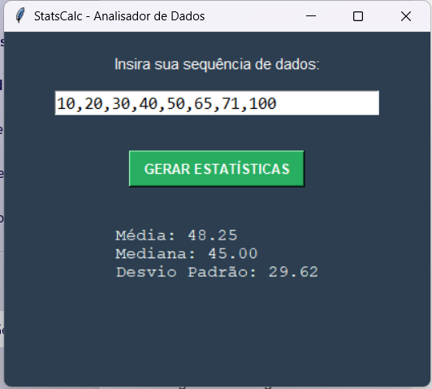

# Statistical Calculator with Python

A simple project to calculate data metrics using Python, Pandas, and Tkinter.

## Features

- Calculation of Mean, Median, and Standard Deviation  
- Intuitive graphical interface  
- Error handling for invalid inputs  

## Technologies

- Python
- Pandas  
- NumPy  
- Tkinter  

## How to run

1. Install the dependencies: pip install -r requirements.txt
2. Run the script: python analisador.py

